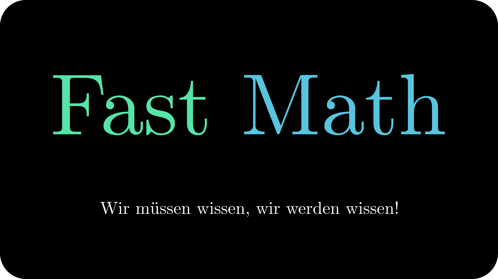

# Fast math

## Ветки
### master
Постаянная оснавная ветка.

В этой ветке хранится стабильная версия кода Manim и LaTeX.

### site
Постаянная обособленная ветка.

В этой ветке находиться код [**сайта**](https://mrshprotter.github.io/fast_math/ "Основной сайт проекта") GitHub Pages.
Подробная информация написана [**по ссылке**](https://github.com/MrShprotter/fast_math/blob/site/README.md "README.md ветки site").

## Дополнительная информация
Переход на ManimGL был отменён по техническим причинам.
